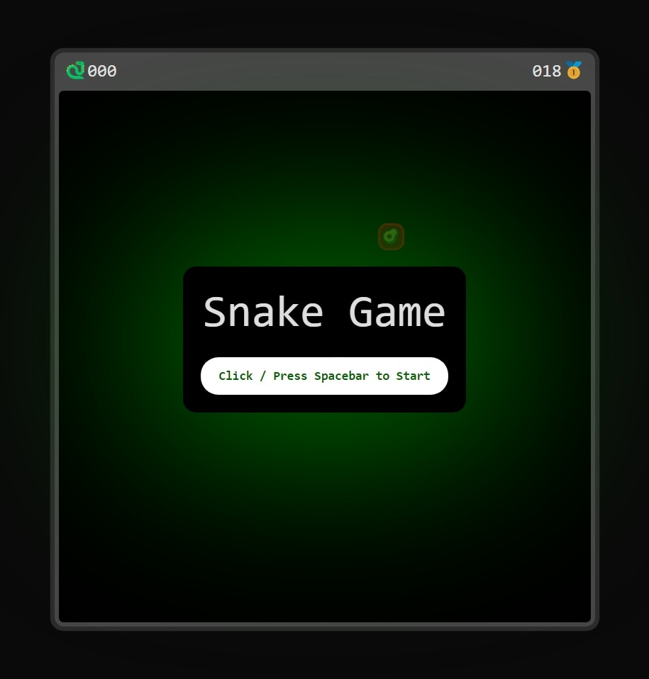
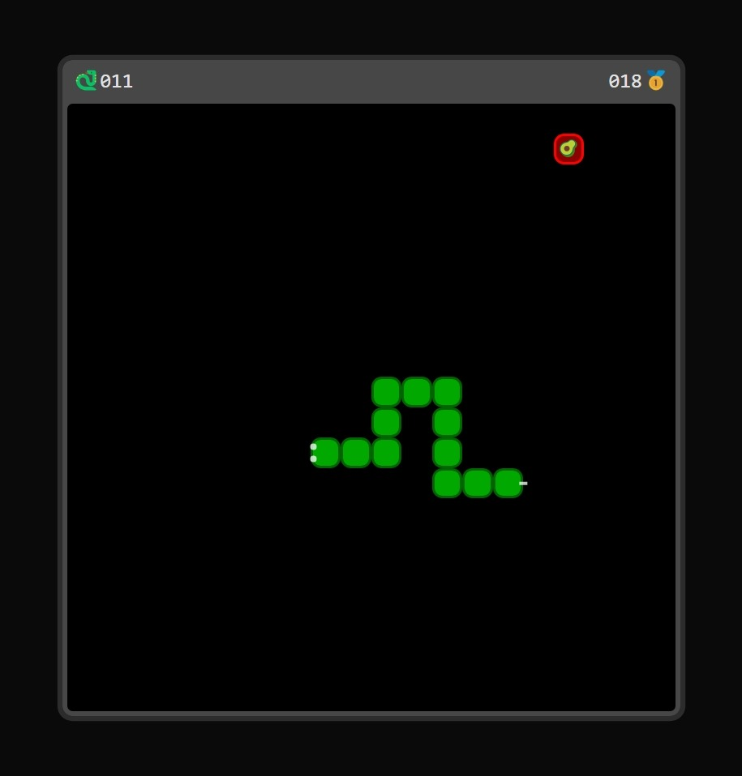

# Snake Game using React + TypeScript

### Want to try it out
- [Click here to play](https://vikas-kukreti.github.io/react-snake-game/)

### how to run it locally ?
- `git clone https://github.com/vikas-kukreti/react-snake-game.git`
- `cd react-snake-game`
- `npm install`
- `npm run dev`

### Generate deployable build
- `npm run build`

### Like it ?
- Contribute by raising a Pull Request 
- Give a Star ⭐

### Connect with me
- [Write a mail at vikaskukreti10@gmail.com](mailto:vikaskukreti10@gmail.com)
- [LinkedIn: https://www.linkedin.com/in/vikas-kukreti/](https://www.linkedin.com/in/vikas-kukreti/)
